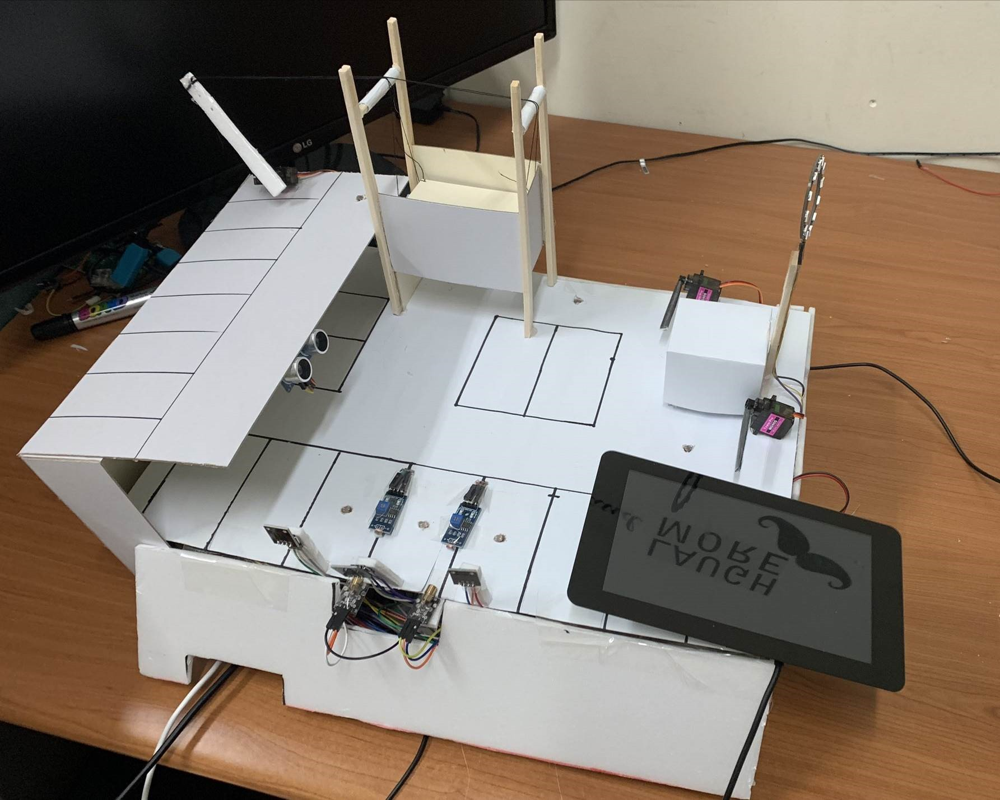
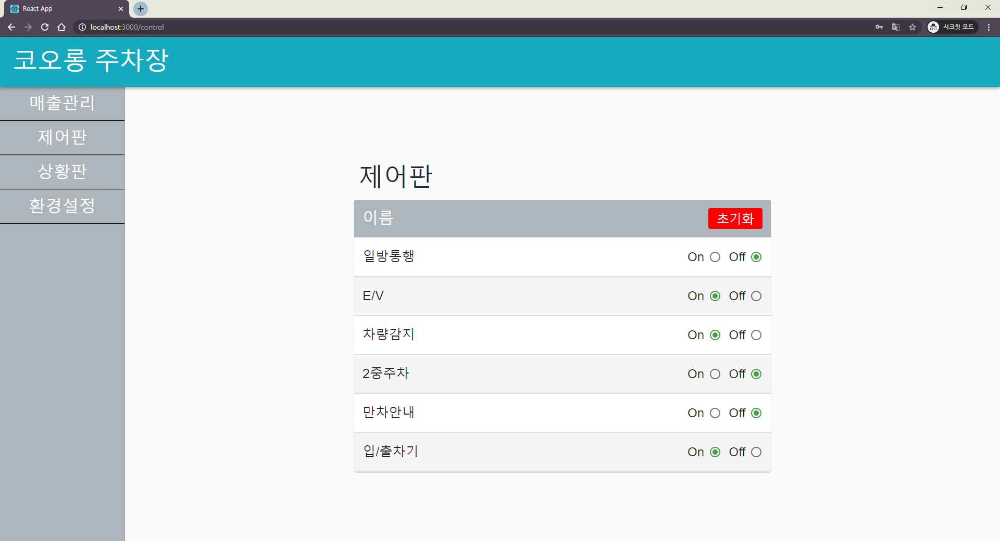

## Smart Parking Lot (Embedded Application Programming Final Project)
웹기반 임베디드, AI 기술을 이용한 스마트 주차장 시스템

### Preview - Device

### Preview - Web (Kiosk)

### Preview - Web (Admin)

### Tech Stack
|Embedded           |Server   |Web    |AI          |Cloud               |
|-------------------|---------|-------|------------|--------------------|
|`Raspberry Pi 3 B+`|`Node.js`|`React`|`Tensorflow`|`Amazon EC2`        |
|`MySQL`            |         |       |            |`AWS Lambda`        |
|                   |         |       |            |`Amazon S3`         |
|                   |         |       |            |`Amazon API Gateway`|

### Developers
|이다은   |이우석   |한혜경   |홍기현   |
|:-------:|:-------:|:-------:|:-------:|
|||||
|[da-nyee](https://github.com/da-nyee)|[qkdrnvhrrur](https://github.com/qkdrnvhrrur)|[Han-HeyGyeong](https://github.com/Han-HeyGyeong)|[ghdrlgus96](https://github.com/ghdrlgus96)|